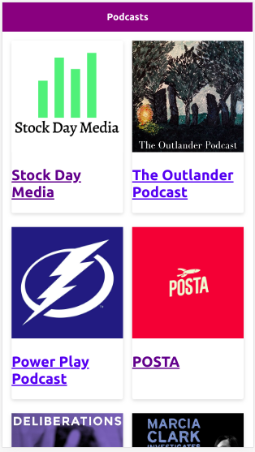

# Podcasts App

This podcast app is integrated with the AudioBoom API.

This is the link to the demo app [click here](https://podcasts-lemon.now.sh/)

## Installation

This app requires node.js

- `npm install` to install the dependencies.
- `npm run dev` to the development environment.
- `npm run build && npm start` to the production environment.

## License

This app has a MIT License
